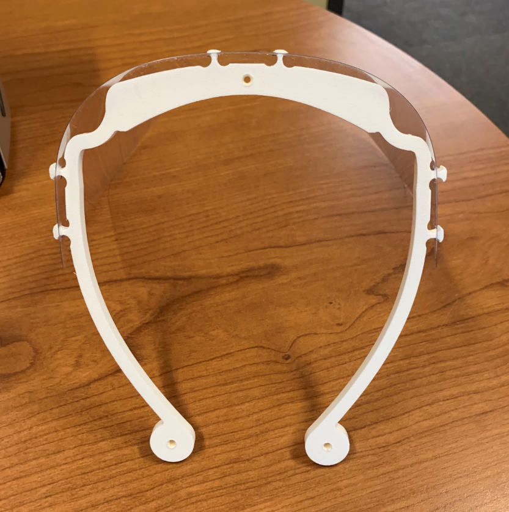
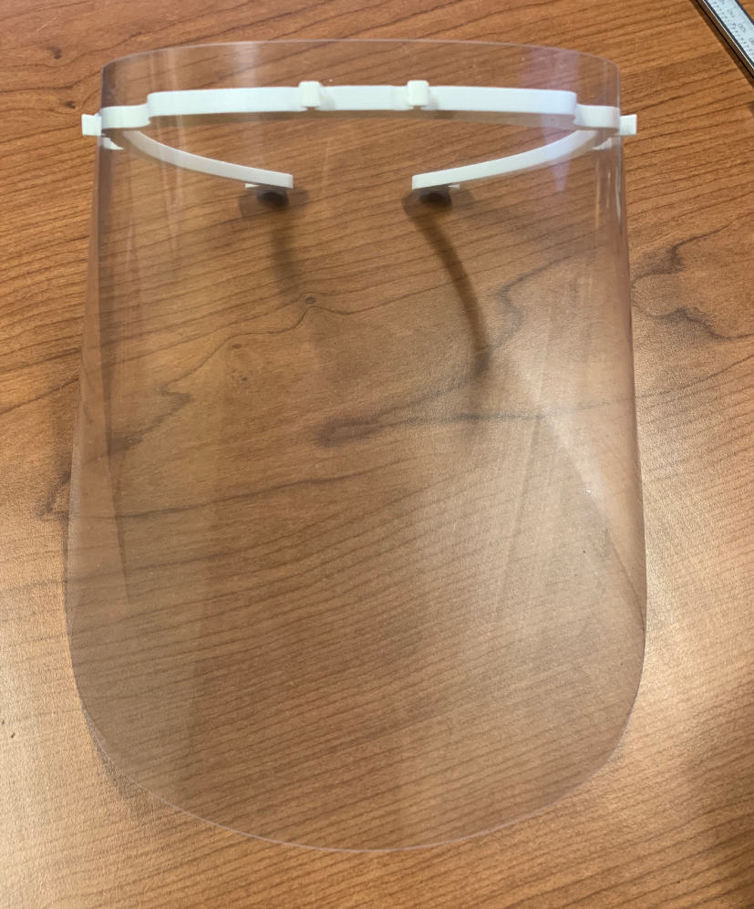
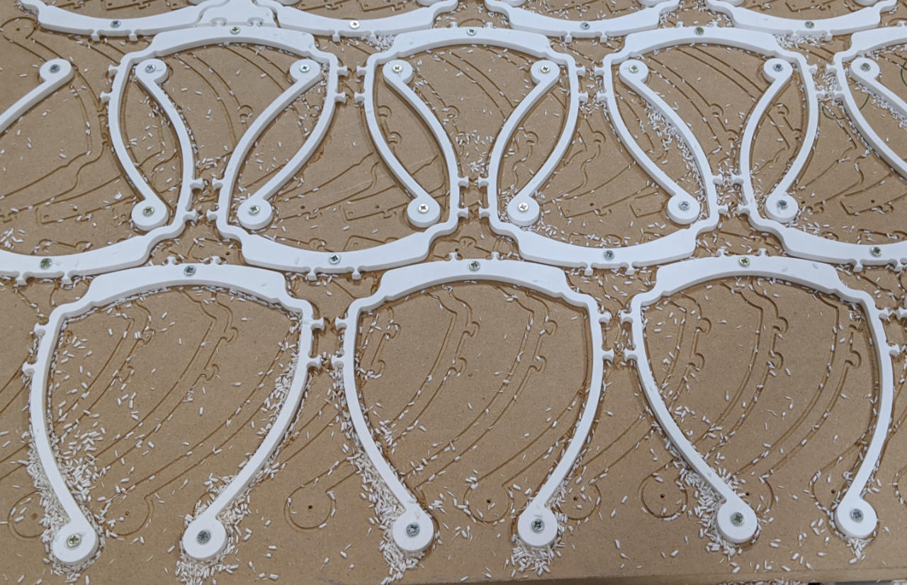

# MMS Face Shield

This is a face shield being produced by [Milwaukee Makerspace](https://milwaukeemakerspace.org/) in Milwaukee, Wisconsin, USA.

The design is a direct descent of a face shield being produced by [Milwaukee Makerspace](https://milwaukeemakerspace.org/) in Milwaukee, Wisconsin, USA.
It is optimized for small-scale mass production with machines available in many Fablabs (large CNC router and 40+W laser cutter, or a plotter).

Because of our material choices it will be easy to clean & sanitize these face shields. We're also facing a shortage of PETG sheets, so using clear vinyl that was available to us was a good option.

## Frame

The frame is cut from 1/4" HDPE sheets on a CNC router. (Note: HDPE cannot be cut on a laser cutter, but it is a great material for milling.)
The frame (headband) was modified to provide less tension on the user's head.
The frame can be produced of a sheet polymer (POM, PET, PET-A) of 6mm in thickness.

## Shield

The face shield can be cut of PET(-A, -H or any other clear sheet polymer); we use a 130W laser cutter for better performance.
It is slightly bigger than the original one, and perfectly fits 600mm wide PET strip that we sourced in rolls.

## Cleaning

Please see the included PDF file with instructions for cleaning this reusable face shield.

## More Info

Check out our blog posts about the process and the progress: https://milwaukeemakerspace.org/tag/mmsppe/

If you want to help support our efforts, you can donate: https://charity.gofundme.com/o/en/campaign/ppe-for-milwaukee

---

Milwaukee Makerspace

https://milwaukeemakerspace.org/

